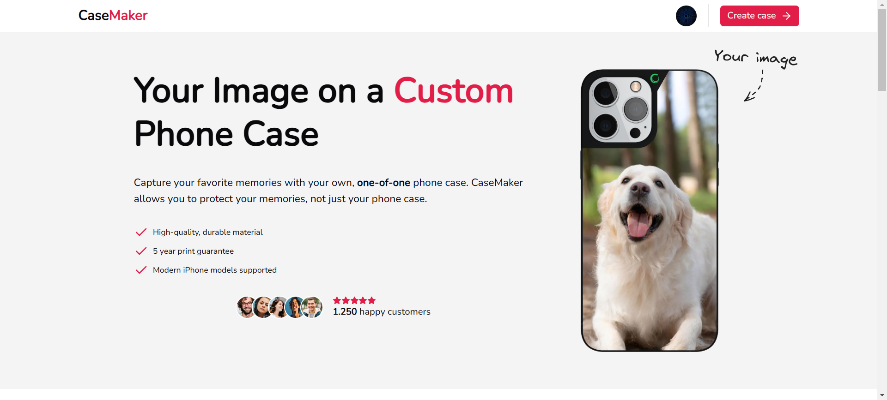
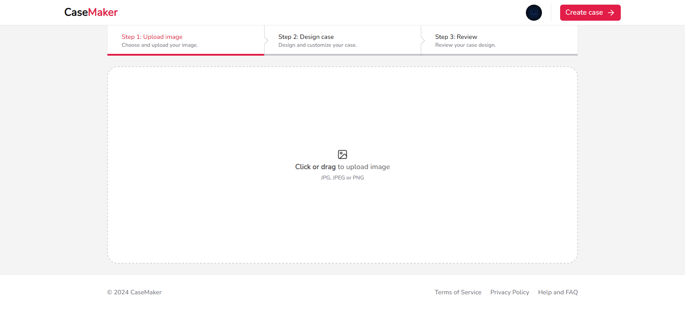
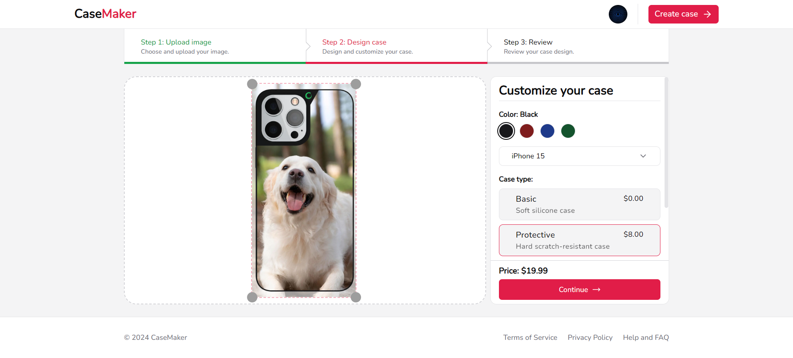
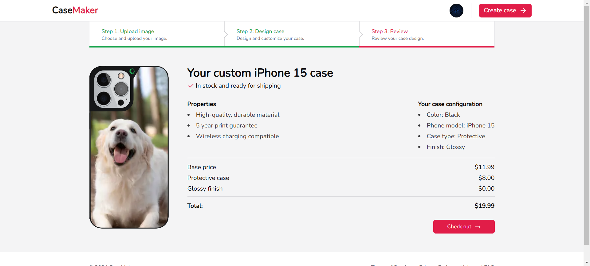

# CaseMaker

## Description

Next.js app for creating custom phone case. You can upload your own image and choose additional features like color, finish and case type. On upload you can preview your design and continue to checkout in stripe test mode.

## Stack

- Next.js 14
- Typescript
- Tailwind CSS
- Shadcn
- Auth.js
- Drizzle ORM
- Stripe
- React Query
- Uploadthing
- Resend
- Posthog

## Screenshots

